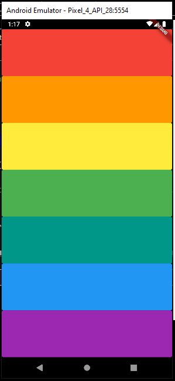

# a4flutter_xylophone_app

A basic xylophone app in flutter.

Explanation Video on Youtube: https://youtu.be/s71A8XIMI6s          
Linkedin Profile Link: https://www.linkedin.com/in/mohammad-bilal-akbar-981649189/          
Github Profile Link: https://github.com/MuhammadBilalAkbar                                         
Youtube Channel Link: https://www.youtube.com/channel/UCu2Hy8Wzb14T37e5Adsfc8w                      
Facebook Profile Link: https://www.facebook.com/mbilalakbar0/

  

  

## Getting Started

This project is a starting point for a Flutter application.

A few resources to get you started if this is your first Flutter project:

- [Lab: Write your first Flutter app](https://flutter.dev/docs/get-started/codelab)
- [Cookbook: Useful Flutter samples](https://flutter.dev/docs/cookbook)

For help getting started with Flutter, view our
[online documentation](https://flutter.dev/docs), which offers tutorials,
samples, guidance on mobile development, and a full API reference.
